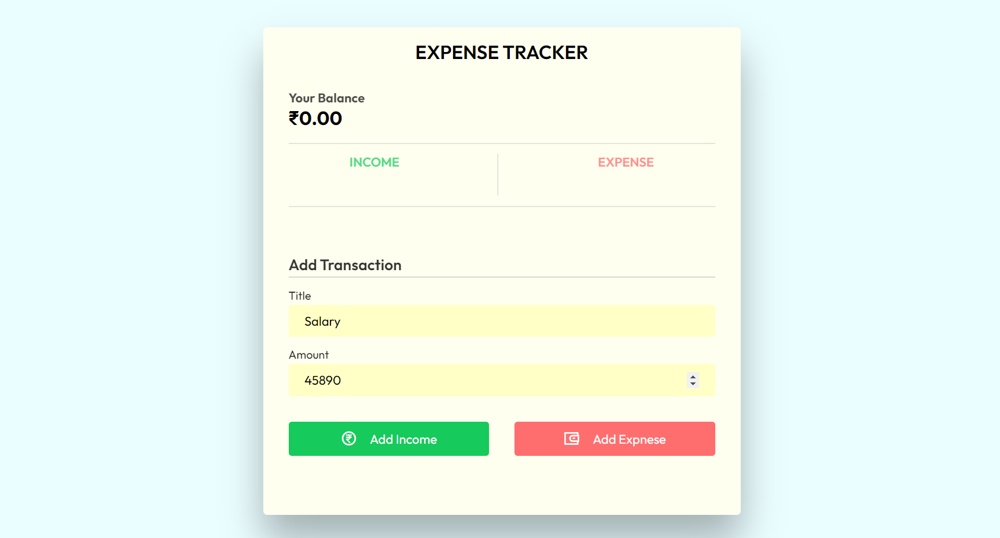
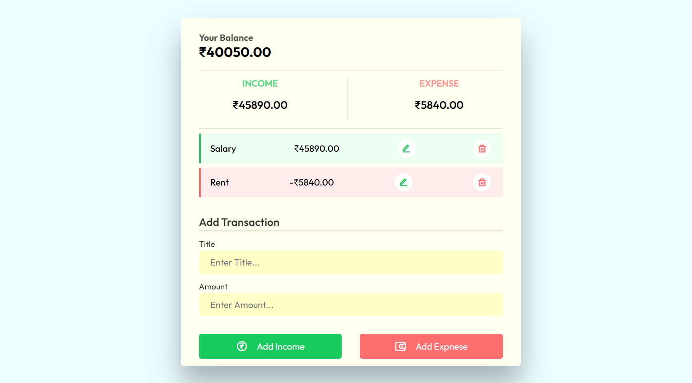
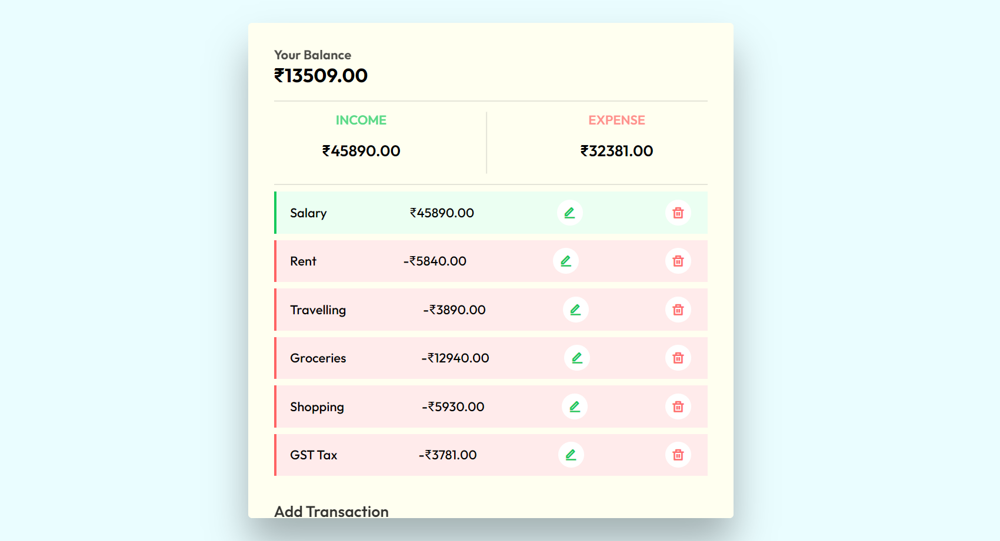
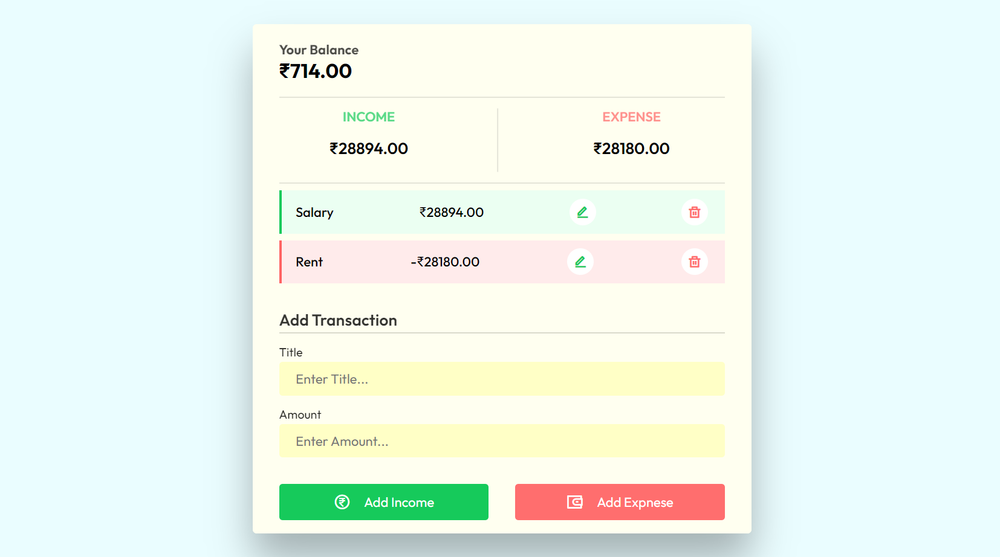

# Expense Tracker

Welcome to the Expense Tracker repository! This project is a JavaScript-based web application designed to help users track their income and expenses effectively. Built with HTML, CSS, and JavaScript, it features a modern UI design for an intuitive and user-friendly experience. The app allows users to add, edit, and delete income and expense entries, and it displays the final balance with color indication for better visibility.

## Preview

### 1. Adding Income or Expense



### 2. Edit And Delete Entry from History



### 4. Stores in Organized Manner



### 5. Stores Data in Local Storage 



## Features

- **Add Income and Expense Entries:** Easily add new income and expense entries with a modern and intuitive interface.
- **Edit Entries:** Edit existing entries to keep financial records accurate.
- **Delete Entries:** Remove unwanted entries effortlessly.
- **Color Indication:** Entries are color-coded (green for income, red for expense) for better visualization.
- **Final Balance Display:** See the final balance after each transaction.
- **Organized History:** View a well-organized history of income and expense entries.
- **Local Storage:** Store transaction data in the local storage for persistence across sessions.

## Getting Started

To run the Expense Tracker locally, follow these steps:

1. Clone the repository to your local machine:

   ```bash
   git clone https://github.com/Devsethi/Expense-Tracker.git
   ```

2. Open the `index.html` file in your preferred web browser.

## Usage

1. Click the "Add Entry" button to add a new income or expense entry.
2. Edit an entry by clicking the "Edit" button.
3. Delete an entry by clicking the "Delete" button.
4. Entries are color-coded for easy identification (green for income, red for expense).
5. The app provides a well-organized history of income and expense entries.

## Customization

Feel free to customize this project to fit your preferences. Update styles, colors, and layout in the HTML and CSS files. You can also extend the functionality to include additional features or customization options.

## Contributing

If you'd like to contribute to this project, please follow these steps:

1. Fork the repository.
2. Create a new branch for your feature or improvement.
3. Make your changes and commit them with descriptive messages.
4. Push your changes to your forked repository.
5. Open a pull request to merge your changes into the main branch.

## License

This project is licensed under the MIT License - see the [LICENSE](LICENSE) file for details.

---

Explore the Expense Tracker, manage your finances effectively, and consider contributing to its development. Thank you for checking out the repository!